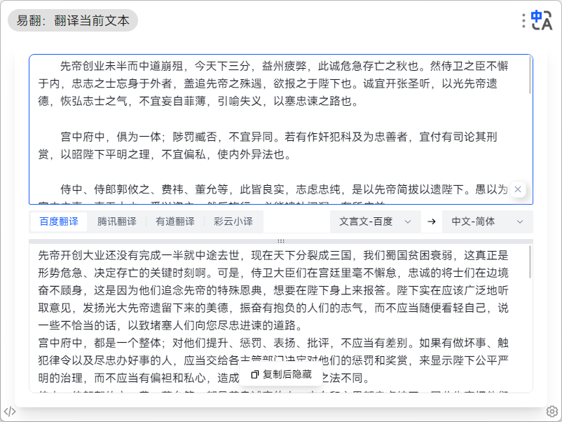
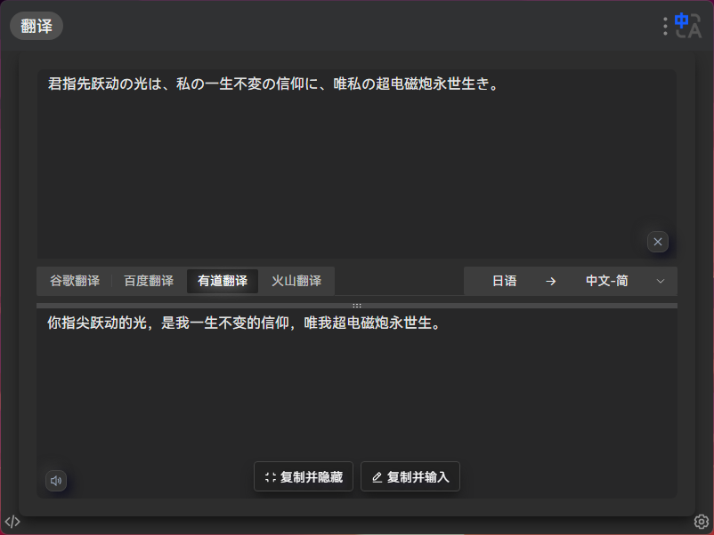
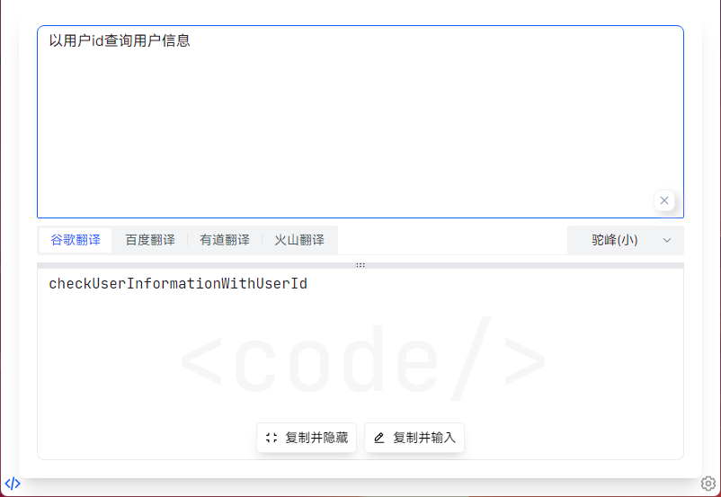
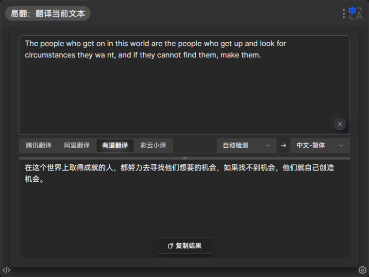

# utools 易翻翻译

## 插件简介

一个翻译插件，通过接入常见翻译平台的服务，来支持多种语言互翻。

本插件主打免费、高效、美观、无广告，做到即用即走、不中断、无干扰。需要您花一点点时间来配置第三方功能才会好用，如果您比较介意，建议您使用utools「聚合翻译」插件或者各翻译平台的网页版本。


## 插件特性

1. 多种语言互翻
2. 自定义翻译方式
3. 自定义输入框文字大小
4. 支持一键复制、快捷键复制（Ctrl+Shift+C / Command+Shift+C）
5. 命名翻译模式（大小驼峰、中下划线、大小分词、对象属性、文件路径、常量）
6. 自动深色模式（将utools软件或操作系统改为深色均可触发）
7. 更优秀的字体展示，低分辨率的Windows用户也能获得和Mac用户一样优秀的文字表现，不用再看那又扁又长还有锯齿的微软雅黑


## 服务申请说明

[易翻插件的相关服务申请说明 (wolai.com)](https://www.wolai.com/jtSV7oah6M7rErz2RMFzo)

## 翻译方式及支持语言

|||||||||
|-|-|-|-|-|-|-|-|
||百度翻译|腾讯翻译|谷歌翻译|阿里翻译|有道翻译|彩云小译|火山翻译|
|中文-简体|✅|✅|✅|✅|✅|✅|✅|
|英语|✅|✅|✅|✅|✅|✅|✅|
|日语|✅|✅|✅|✅|✅|✅|✅|
|俄语|✅|✅|✅|✅|✅|✅|✅|
|韩语|✅|✅|✅|✅|✅||✅|
|德语|✅|✅|✅|✅|✅||✅|
|法语|✅|✅|✅|✅|✅||✅|
|中文-繁体|✅|✅|✅|✅|✅||✅|
|粤语|✅|||✅|✅|||
|文言文|✅|||||||


## 代码模式快捷键

通过以下快捷键可以直接进入命名翻译模式，帮助你快速命名

1. mmxt（“命名小驼”的首字母）：小驼峰模式，如 "getUserInformation"
2. mmdt（“命名大驼”的首字母）：大驼峰模式，如 "GetUserInformation"
3. mmxh（“命名下划”的首字母）：下划线模式，如 "get_user_information"
4. mmzhx（“命名中划小”的首字母）：中划线小写模式，如 "get-user-information"
5. mmzhd（“命名中划大”的首字母）：中划线大写模式，如 "Get-User-Information"
6. mmfcx（“命名分词小”的首字母）：分词小写模式，如 "get user information"
7. mmfcd（“命名分词大”的首字母）：分词大写模式，如 "Get User Information"
8. mmdx（“命名对象”的首字母）：对象属性模式，如 "get.user.information"
9. mmwj（“命名文件”的首字母）：文件路径模式，如 "get/user/information"
10. mmcl（“命名常量”的首字母）：常量模式，如 "GET_USER_INFORMATION"

## 插件截图

 

 

 

 

 


## 贡献者

感谢所有已经为易翻插件做出贡献的人！

[Lainbo (lainbo) - Gitee.com](https://gitee.com/lainbo)

[Milo (Milo_admin) - Gitee.com](https://gitee.com/Milo_admin)


## 开发说明

### 安装依赖

```bash
yarn
```

### 开发环境运行

修改插件配置文件中的 preload 路径，并配置开发环境入口为本地服务

/public/plugin.json

```json
{
  "preload": "./preload/src/index.js",
  "development": {
    "main": "http://127.0.0.1:6789"
  }
}
```

启动开发服务器

```bash
yarn run dev
```

### 打包发布

打包 preload

```bash
yarn run p:build
```

vite 打包

```bash
yarn run build
```

修改打包后插件配置文件中的主入口文件和 preload 路径

/dist/plugin.json

```json
{
  "main": "./index.html",
  "preload": "./preload/dist/index.js"
}
```

### 版本记录

#### 当前版本
v1.5.2

#### 版本号规范

v大版本.功能版本.bug修复版

#### 版本日志规范

新增：
1. AI识别语言语言并翻译至目标外语(目前支持英、日、俄)
2. 关键字调整，突出任意文本关键字智能，新增【fjyi】关键字
优化：
1. 优化设置弹窗动画
2. 移除命名翻译模式的设置存储，可通过命名模式专属关键字【mmxx】来打开命名翻译模式，或在首页切换命名翻译模式，状态将保持直到插件退出
3. UI优化
修复：修复已知bug

...
